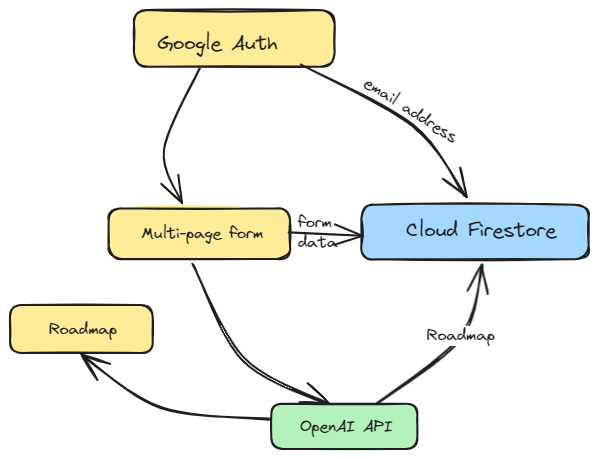

Portals
-----
> Live link: [http://portalss.up.railway.app](portalss.up.railway.app)

### Motivation
My friends and I were in spots that could define our careers - we know what we want to be but how do we get there. We quickly realized that most "roadmaps" are generalized, comprehensive and as a result, overwhelming. 

We decided to use AI to build something simpler - personalized to you, what you have learnt/done in the past and what you want to become.


### Overview
Portals makes it easier to get started in tech as a beginner by generating a personalized roadmap containing quality resources for you.

- You log in using Google Authentication
- You fill a multi-page form that helps us understand you, what you have done in the past and your current career goal
- You sit back and see in <2 minutes your personalized roadmap with quality resources.


### Demo 


### Tech Stack

- **React** - Frontend framework
- **Vanilla CSS** - Styling the page
- **Firebase Cloud Filestore** - Database for storage of user details and roadmap
- **Flask** - Backend framework
- **OpenAI API** - API for generating the roadmap
- **React-Chrono** - Library for converting the roadmap into a timeline
- **Railway** - Deployment service

### Architecture


### Development Setup

1. Clone the repo

```
$ git clone https://github.com/hemjay07/Portals.git portals
$ cd portals
```

2. Install the dependencies:

```
$ pip install -r requirements.txt
```

3. Put your OpenAI key in app.py

```
 openai.api_key = your_key
```

4. Run the development server:

```
$ python app.py
```

5. Navigate to the Home page [http://127.0.0.1:5000](http://127.0.0.1:5000)

### Potential Additional Features
  
1. Write tests for the app
2. Add feature to download a PDF version of the roadmap
3. Add feature for users to receive push notifications when the deadline of completing one course is done

### Collaborators
- [Opeyimika Aremu](linkedin.com/in/opeyimikaaremu/)
- [Mujeeb Opabode](https://ng.linkedin.com/in/abdulmujeeb-opabode-46080716a)
- [Abdulquddus Ajibade](https://ng.linkedin.com/in/ajibadeadedayoabdulquddus)
